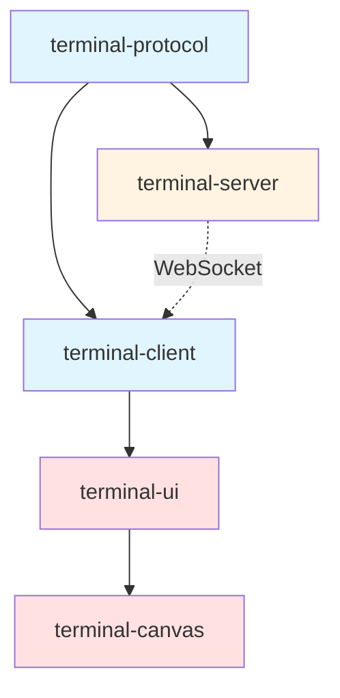

# Bohemian Agent Control - 终端架构设计

## 🎯 设计原则

1. **前后端清晰分离** - 职责明确，接口清晰
2. **前端高性能** - 虚拟化、批量处理、WebGL加速
3. **高可维护性** - Monorepo模块化，单一职责

---

## 📦 Monorepo 结构

```
bohemian-agent-control/
├── packages/
│   ├── terminal-protocol/       # 🔷 协议层（前后端共享）
│   │   ├── src/
│   │   │   ├── types.ts         # 类型定义
│   │   │   ├── rpc-protocol.ts  # RPC协议
│   │   │   └── events.ts        # 事件定义
│   │   └── package.json
│   │
│   ├── terminal-server/         # 🔶 后端服务（Node.js）
│   │   ├── src/
│   │   │   ├── index.ts         # 服务入口
│   │   │   ├── pty/             # PTY管理
│   │   │   ├── session/         # 会话管理
│   │   │   ├── transport/       # WebSocket服务
│   │   │   └── persistence/     # 持久化
│   │   └── package.json
│   │
│   ├── terminal-client/         # 🔷 前端通信层
│   │   ├── src/
│   │   │   ├── index.ts         # 客户端入口
│   │   │   ├── transport.ts     # WebSocket客户端
│   │   │   ├── rpc-client.ts    # RPC调用
│   │   │   └── subscription.ts  # 订阅管理
│   │   └── package.json
│   │
│   ├── terminal-ui/             # 🎨 UI组件（React）
│   │   ├── src/
│   │   │   ├── components/
│   │   │   │   ├── Terminal/           # 终端组件
│   │   │   │   ├── TerminalModal/      # 弹窗终端
│   │   │   │   └── TerminalManager/    # 多终端管理
│   │   │   ├── hooks/
│   │   │   │   ├── useTerminal.ts
│   │   │   │   └── useTerminalSession.ts
│   │   │   └── store/
│   │   │       └── terminal-store.ts   # Zustand状态
│   │   └── package.json
│   │
│   └── terminal-canvas/         # 🎨 画板集成
│       ├── src/
│       │   ├── CanvasTerminalNode.tsx  # 画板节点
│       │   ├── TerminalConnection.tsx  # 连线组件
│       │   └── TerminalTray.tsx        # 终端托盘
│       └── package.json
│
└── apps/
    └── web/                     # 你的主应用
        └── uses packages above
```

---

## 🏗️ 职责划分

### 1️⃣ 后端职责（terminal-server）

**核心任务：管理 PTY 进程生命周期**

```typescript
// packages/terminal-server/src/index.ts
export class TerminalServer {
  private ptyManager: PtyManager
  private sessionManager: SessionManager
  private transport: WebSocketTransport
  
  // ✅ 职责：PTY 进程管理
  async createTerminal(config: TerminalConfig): Promise<TerminalId>
  async destroyTerminal(id: TerminalId): Promise<void>
  async writeToTerminal(id: TerminalId, data: string): Promise<void>
  async resizeTerminal(id: TerminalId, cols: number, rows: number): Promise<void>
  
  // ✅ 职责：会话持久化
  async saveSession(id: TerminalId): Promise<void>
  async restoreSession(id: TerminalId): Promise<TerminalState>
  
  // ✅ 职责：性能优化（批量发送）
  private batchOutputs(): void // 累积100ms的输出一次发送
  private applyBackpressure(): void // 客户端忙时暂停推送
}
```

**关键模块**：

```
terminal-server/src/
├── pty/
│   ├── PtyManager.ts           # PTY 池管理
│   ├── PtyProcess.ts           # 单个 PTY 封装
│   ├── OutputBuffer.ts         # 输出缓冲（批量发送）
│   └── BackpressureController.ts # 背压控制
│
├── session/
│   ├── SessionManager.ts       # 会话管理
│   ├── SessionStore.ts         # 会话存储（SQLite）
│   └── SessionRecovery.ts      # 崩溃恢复
│
├── transport/
│   ├── WebSocketServer.ts      # WS 服务器
│   ├── RpcHandler.ts           # RPC 请求处理
│   └── SubscriptionHub.ts      # 事件订阅中心
│
└── persistence/
    ├── HistoryStore.ts         # 终端历史存储
    └── StateSerializer.ts      # 状态序列化
```

**性能优化点**：

```typescript
// packages/terminal-server/src/pty/OutputBuffer.ts
export class OutputBuffer {
  private buffer: string[] = []
  private timer: NodeJS.Timeout | null = null
  
  // ✅ 批量发送：累积100ms的输出
  append(data: string): void {
    this.buffer.push(data)
    
    if (!this.timer) {
      this.timer = setTimeout(() => {
        this.flush()
      }, 100) // 批量延迟
    }
    
    // 如果累积超过阈值，立即发送（防止延迟过高）
    if (this.buffer.join('').length > 8192) {
      this.flush()
    }
  }
  
  flush(): void {
    if (this.buffer.length === 0) return
    
    const data = this.buffer.join('')
    this.buffer = []
    
    if (this.timer) {
      clearTimeout(this.timer)
      this.timer = null
    }
    
    this.transport.send({
      type: 'terminal:output',
      data,
      timestamp: Date.now()
    })
  }
}
```

---

### 2️⃣ 前端职责（terminal-client + terminal-ui）

**核心任务：高性能渲染和用户交互**

#### A. 通信层（terminal-client）

```typescript
// packages/terminal-client/src/index.ts
export class TerminalClient {
  private transport: WebSocketTransport
  private rpcClient: RpcClient
  private subscriptions: SubscriptionManager
  
  // ✅ 职责：RPC 调用
  async createTerminal(config: TerminalConfig): Promise<TerminalId> {
    return this.rpcClient.call('terminal.create', config)
  }
  
  // ✅ 职责：订阅终端输出
  subscribeToOutput(
    terminalId: TerminalId, 
    callback: (data: string) => void
  ): Unsubscribe {
    return this.subscriptions.subscribe(
      `terminal:output:${terminalId}`,
      callback
    )
  }
  
  // ✅ 职责：背压控制
  pauseOutput(terminalId: TerminalId): void {
    this.rpcClient.call('terminal.pause', { id: terminalId })
  }
  
  resumeOutput(terminalId: TerminalId): void {
    this.rpcClient.call('terminal.resume', { id: terminalId })
  }
}
```

#### B. UI 组件（terminal-ui）

```typescript
// packages/terminal-ui/src/components/Terminal/Terminal.tsx
import { Terminal as XTerm } from '@xterm/xterm'
import { FitAddon } from '@xterm/addon-fit'
import { WebglAddon } from '@xterm/addon-webgl'
import { useTerminalSession } from '../../hooks/useTerminalSession'

export const Terminal: React.FC<TerminalProps> = ({ 
  terminalId, 
  onClose 
}) => {
  const terminalRef = useRef<HTMLDivElement>(null)
  const xtermRef = useRef<XTerm>()
  
  // ✅ 职责：终端渲染
  useEffect(() => {
    if (!terminalRef.current) return
    
    const xterm = new XTerm({
      fontSize: 14,
      fontFamily: 'Menlo, Monaco, monospace',
      theme: { background: '#1e1e1e' },
      // ⚡ 性能优化：启用 WebGL
      rendererType: 'webgl'
    })
    
    const fitAddon = new FitAddon()
    const webglAddon = new WebglAddon()
    
    xterm.loadAddon(fitAddon)
    xterm.loadAddon(webglAddon)
    
    xterm.open(terminalRef.current)
    fitAddon.fit()
    
    xtermRef.current = xterm
    
    return () => xterm.dispose()
  }, [])
  
  // ✅ 职责：订阅输出
  const { write, isConnected } = useTerminalSession(terminalId, xtermRef)
  
  // ✅ 职责：用户输入
  useEffect(() => {
    const xterm = xtermRef.current
    if (!xterm) return
    
    const disposable = xterm.onData((data) => {
      write(data) // 发送到后端
    })
    
    return () => disposable.dispose()
  }, [write])
  
  return (
    <div className="terminal-container">
      <div ref={terminalRef} className="terminal" />
      {!isConnected && <div className="reconnecting">重连中...</div>}
    </div>
  )
}
```

**性能优化 Hook**：

```typescript
// packages/terminal-ui/src/hooks/useTerminalSession.ts
export function useTerminalSession(
  terminalId: string,
  xtermRef: React.RefObject<XTerm>
) {
  const client = useTerminalClient()
  const [isConnected, setIsConnected] = useState(false)
  
  // ✅ 性能优化：批量写入
  const writeQueue = useRef<string[]>([])
  const flushTimer = useRef<number>()
  
  const flushWrites = useCallback(() => {
    const xterm = xtermRef.current
    if (!xterm || writeQueue.current.length === 0) return
    
    // 一次写入所有累积的数据
    const data = writeQueue.current.join('')
    xterm.write(data)
    writeQueue.current = []
  }, [xtermRef])
  
  useEffect(() => {
    // ✅ 订阅输出
    const unsubscribe = client.subscribeToOutput(
      terminalId,
      (data: string) => {
        // 累积输出，减少渲染次数
        writeQueue.current.push(data)
        
        if (!flushTimer.current) {
          flushTimer.current = window.setTimeout(flushWrites, 16) // 60fps
        }
      }
    )
    
    setIsConnected(true)
    
    return () => {
      unsubscribe()
      if (flushTimer.current) {
        clearTimeout(flushTimer.current)
      }
    }
  }, [terminalId, client, flushWrites])
  
  // ✅ 防抖写入
  const write = useDebouncedCallback(
    (data: string) => client.write(terminalId, data),
    10 // 10ms 防抖
  )
  
  return { write, isConnected }
}
```

---

### 3️⃣ 协议层（terminal-protocol）

**核心任务：类型安全的前后端通信**

```typescript
// packages/terminal-protocol/src/types.ts

// ============ 基础类型 ============
export type TerminalId = string
export type SessionId = string
export type NodeId = string

// ============ 终端配置 ============
export interface TerminalConfig {
  cwd?: string
  env?: Record<string, string>
  shell?: string
  cols?: number
  rows?: number
}

// ============ RPC 方法定义 ============
export interface TerminalRpcMethods {
  // 终端管理
  'terminal.create': (config: TerminalConfig) => Promise<TerminalId>
  'terminal.destroy': (id: TerminalId) => Promise<void>
  'terminal.write': (params: { id: TerminalId; data: string }) => Promise<void>
  'terminal.resize': (params: { id: TerminalId; cols: number; rows: number }) => Promise<void>
  
  // 会话管理
  'session.save': (id: TerminalId) => Promise<SessionId>
  'session.restore': (sessionId: SessionId) => Promise<TerminalState>
  'session.list': () => Promise<SessionInfo[]>
  
  // 背压控制
  'terminal.pause': (id: TerminalId) => Promise<void>
  'terminal.resume': (id: TerminalId) => Promise<void>
}

// ============ 事件定义 ============
export interface TerminalEvents {
  'terminal:output': { id: TerminalId; data: string; timestamp: number }
  'terminal:exit': { id: TerminalId; code: number }
  'terminal:resize': { id: TerminalId; cols: number; rows: number }
  'terminal:title': { id: TerminalId; title: string }
}

// ============ 状态定义 ============
export interface TerminalState {
  id: TerminalId
  config: TerminalConfig
  pid?: number
  status: 'running' | 'paused' | 'exited'
  history: string // 终端历史（可恢复）
  cursor: { x: number; y: number }
  size: { cols: number; rows: number }
}
```

---

## ⚡ 前端性能优化策略

### 1. 虚拟化渲染

```typescript
// packages/terminal-ui/src/components/TerminalManager/TerminalManager.tsx
import { useVirtualizer } from '@tanstack/react-virtual'

export const TerminalManager: React.FC = () => {
  const terminals = useTerminalStore(state => state.terminals)
  const containerRef = useRef<HTMLDivElement>(null)
  
  // ✅ 只渲染可见的终端
  const virtualizer = useVirtualizer({
    count: terminals.length,
    getScrollElement: () => containerRef.current,
    estimateSize: () => 400, // 每个终端高度
    overscan: 1 // 预渲染1个
  })
  
  return (
    <div ref={containerRef} className="terminal-list">
      <div style={{ height: `${virtualizer.getTotalSize()}px` }}>
        {virtualizer.getVirtualItems().map(item => (
          <div
            key={item.key}
            style={{
              position: 'absolute',
              top: 0,
              left: 0,
              width: '100%',
              transform: `translateY(${item.start}px)`
            }}
          >
            <Terminal terminalId={terminals[item.index].id} />
          </div>
        ))}
      </div>
    </div>
  )
}
```

### 2. React 优化

```typescript
// packages/terminal-ui/src/components/Terminal/Terminal.tsx

// ✅ Memo 防止不必要的重渲染
export const Terminal = React.memo<TerminalProps>(({ terminalId, onClose }) => {
  // ... terminal 实现
}, (prev, next) => {
  // 只有 terminalId 变化时才重新渲染
  return prev.terminalId === next.terminalId
})

// ✅ useMemo 缓存昂贵计算
const terminalOptions = useMemo(() => ({
  fontSize: 14,
  fontFamily: 'Menlo, Monaco, monospace',
  theme: { background: '#1e1e1e' }
}), []) // 空依赖，永不变化
```

### 3. Web Worker 处理大数据

```typescript
// packages/terminal-ui/src/workers/terminal-parser.worker.ts

// ✅ 在 Worker 中解析 ANSI 转义序列
self.addEventListener('message', (e: MessageEvent<string>) => {
  const parsed = parseAnsiSequences(e.data)
  self.postMessage(parsed)
})

// 主线程使用
const worker = new Worker(new URL('./terminal-parser.worker.ts', import.meta.url))
worker.postMessage(rawData)
worker.onmessage = (e) => {
  xterm.write(e.data)
}
```

---

## 🎨 画板集成

### 画板节点组件

```typescript
// packages/terminal-canvas/src/CanvasTerminalNode.tsx
import { Handle, Position } from 'reactflow'
import { useTerminalStore } from '@pi/terminal-ui'

export const CanvasTerminalNode: React.FC<NodeProps> = ({ data }) => {
  const openTerminal = useTerminalStore(state => state.openTerminal)
  
  const handleDoubleClick = () => {
    // ✅ 双击打开终端弹窗
    openTerminal({
      nodeId: data.id,
      config: {
        cwd: data.workingDir,
        env: data.env
      }
    })
  }
  
  return (
    <div 
      className="canvas-node" 
      onDoubleClick={handleDoubleClick}
    >
      <Handle type="target" position={Position.Top} />
      
      <div className="node-content">
        <div className="node-icon">💻</div>
        <div className="node-label">{data.label}</div>
        {data.terminalId && (
          <div className="terminal-indicator">
            🟢 Terminal Active
          </div>
        )}
      </div>
      
      <Handle type="source" position={Position.Bottom} />
    </div>
  )
}
```

### 终端弹窗

```typescript
// packages/terminal-canvas/src/TerminalModal.tsx
import { Terminal } from '@pi/terminal-ui'
import { Dialog } from '@radix-ui/react-dialog'

export const TerminalModal: React.FC<TerminalModalProps> = ({ 
  nodeId, 
  terminalId, 
  onClose 
}) => {
  return (
    <Dialog open={!!terminalId} onOpenChange={onClose}>
      <DialogContent className="terminal-modal">
        <DialogTitle>Terminal - Node {nodeId}</DialogTitle>
        
        <div className="terminal-wrapper">
          {terminalId && (
            <Terminal 
              terminalId={terminalId} 
              onClose={onClose} 
            />
          )}
        </div>
        
        <DialogClose />
      </DialogContent>
    </Dialog>
  )
}
```

---

## 🗂️ 状态管理

```typescript
// packages/terminal-ui/src/store/terminal-store.ts
import { create } from 'zustand'
import { persist } from 'zustand/middleware'

interface TerminalState {
  terminals: Map<TerminalId, TerminalInfo>
  activeTerminalId: TerminalId | null
  
  // Actions
  openTerminal: (config: OpenTerminalConfig) => Promise<TerminalId>
  closeTerminal: (id: TerminalId) => void
  setActiveTerminal: (id: TerminalId) => void
  
  // Node 关联
  nodeTerminals: Map<NodeId, TerminalId>
  linkTerminalToNode: (terminalId: TerminalId, nodeId: NodeId) => void
}

export const useTerminalStore = create<TerminalState>()(
  persist(
    (set, get) => ({
      terminals: new Map(),
      activeTerminalId: null,
      nodeTerminals: new Map(),
      
      openTerminal: async (config) => {
        const client = getTerminalClient()
        const terminalId = await client.createTerminal(config.config)
        
        set(state => ({
          terminals: new Map(state.terminals).set(terminalId, {
            id: terminalId,
            nodeId: config.nodeId,
            createdAt: Date.now()
          }),
          activeTerminalId: terminalId,
          nodeTerminals: new Map(state.nodeTerminals).set(
            config.nodeId, 
            terminalId
          )
        }))
        
        return terminalId
      },
      
      closeTerminal: (id) => {
        const client = getTerminalClient()
        client.destroyTerminal(id)
        
        set(state => {
          const terminals = new Map(state.terminals)
          const terminal = terminals.get(id)
          terminals.delete(id)
          
          const nodeTerminals = new Map(state.nodeTerminals)
          if (terminal?.nodeId) {
            nodeTerminals.delete(terminal.nodeId)
          }
          
          return {
            terminals,
            nodeTerminals,
            activeTerminalId: state.activeTerminalId === id 
              ? null 
              : state.activeTerminalId
          }
        })
      },
      
      setActiveTerminal: (id) => set({ activeTerminalId: id }),
      
      linkTerminalToNode: (terminalId, nodeId) => {
        set(state => ({
          nodeTerminals: new Map(state.nodeTerminals).set(nodeId, terminalId)
        }))
      }
    }),
    {
      name: 'terminal-store',
      partialize: (state) => ({
        // 只持久化必要的数据
        nodeTerminals: Array.from(state.nodeTerminals.entries())
      })
    }
  )
)
```

---

## 📊 依赖关系



---

## 🚀 开发顺序

### Phase 1: 协议 + 后端 (Week 1-3)
1. ✅ `terminal-protocol` - 定义类型
2. ✅ `terminal-server` - PTY 管理
3. ✅ `terminal-server` - WebSocket 服务

### Phase 2: 前端通信 (Week 3-4)
4. ✅ `terminal-client` - RPC 调用
5. ✅ `terminal-client` - 订阅管理

### Phase 3: UI 组件 (Week 4-5)
6. ✅ `terminal-ui` - Terminal 组件
7. ✅ `terminal-ui` - Hooks
8. ✅ `terminal-ui` - Store

### Phase 4: 画板集成 (Week 5-6)
9. ✅ `terminal-canvas` - 节点组件
10. ✅ `terminal-canvas` - 弹窗
11. ✅ `terminal-canvas` - 连线

### Phase 5: 优化 (Week 6-8)
12. ✅ 虚拟化渲染
13. ✅ WebGL 加速
14. ✅ 持久化
15. ✅ 性能监控

---

## 📝 总结

### ✅ 前后端职责清晰
- **后端**：PTY 进程管理、批量发送、持久化
- **前端**：UI 渲染、用户交互、状态管理
- **协议**：类型安全的通信契约

### ⚡ 高性能保证
- 批量发送（后端100ms缓冲）
- 批量渲染（前端16ms缓冲）
- WebGL 加速
- 虚拟化列表
- React 优化（memo、useMemo）
- 背压控制

### 🗂️ 高可维护性
- Monorepo 清晰模块化
- 单一职责原则
- TypeScript 类型安全
- 依赖注入
- 测试友好

**这样的架构既能满足你的功能需求，又能保证性能和可维护性！** 🎉
