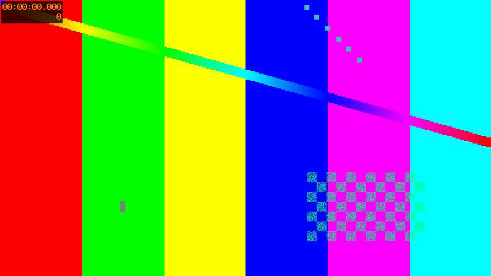
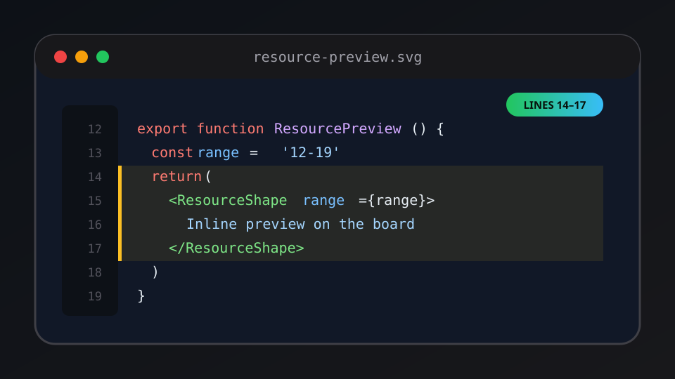

# Resource Preview Gallery

> Created on 2026-09-28 to verify inline resource rendering on the tldraw board.

This Markdown document exercises headings, tables, task lists, code blocks, links, and **local embedded images**.

## Local PNG image

The image below is a generated 800×450 PNG test pattern:



## Local image with spaces in its path


## Local SVG image



## Feature checklist

- [x] Render Markdown instead of raw source
- [x] Load local images through the authenticated file API
- [x] Block remote tracking images
- [x] Support GFM tables and task lists
- [ ] Verify the result manually on the board

## Preview matrix

| Resource | Expected result |
| --- | --- |
| `code/ExamplePanel.tsx:12-26` | Shiki highlighting and amber range |
| `data/sample.json` | JSON syntax highlighting |
| `data/people.csv` | CSV source with line numbers |
| `assets/resource-preview.svg` | Image on checkerboard background |
| `media/test-tone.wav` | Native audio controls |
| `media/test-video.mp4` | Native video controls |
| `docs/sample.pdf` | Embedded PDF viewer |

## Code block

```tsx
export function PreviewBadge({ range }: { range: string }) {
  return <span className="preview-badge">{range}</span>
}
```

## Quoted note

> A `file.tsx:1-15` reference is a focused source window. It should not fabricate a red/green diff without before/after content.

## Safe link

[Open the example website](https://example.com/)

## Remote image policy

The following remote image should be blocked to avoid unexpected tracking requests:


